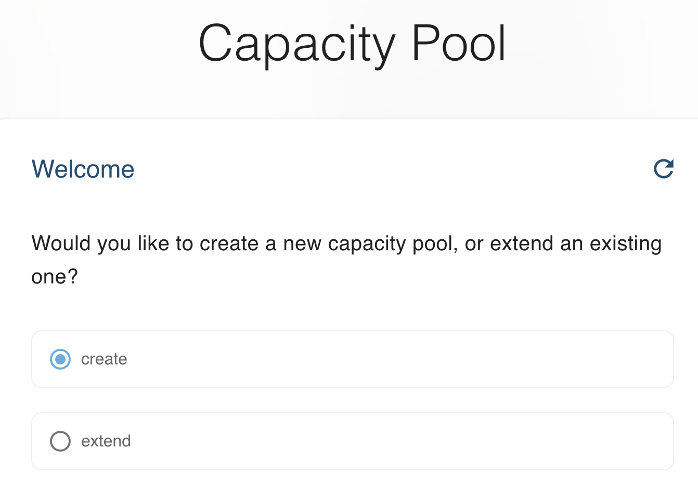
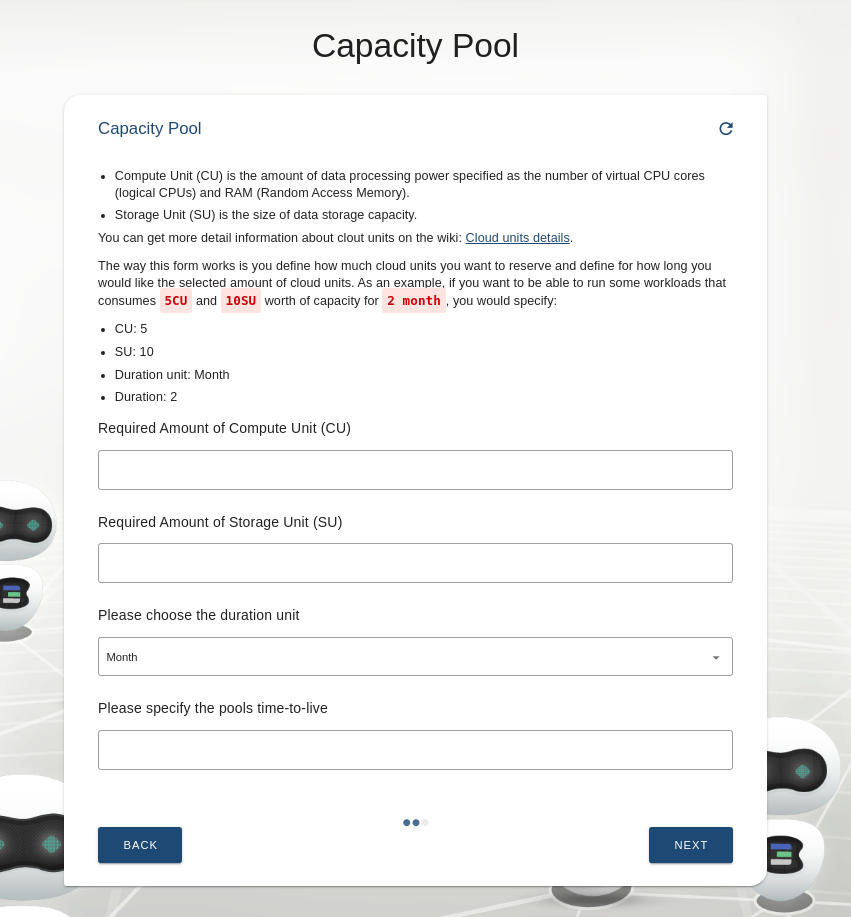
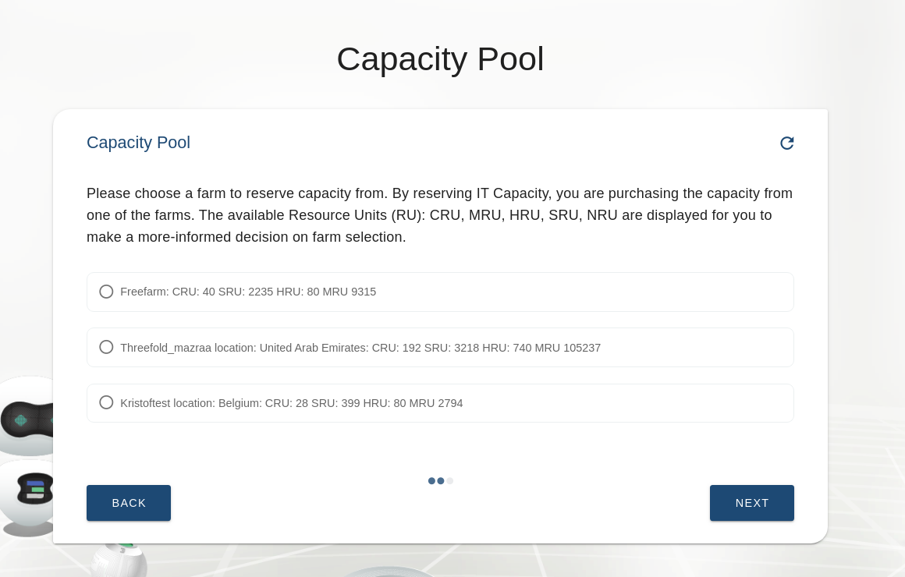
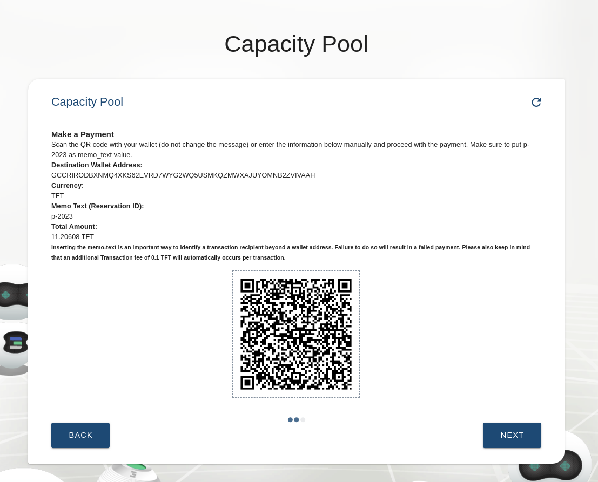
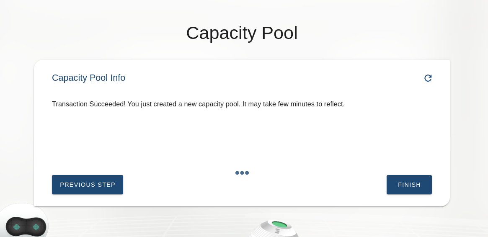
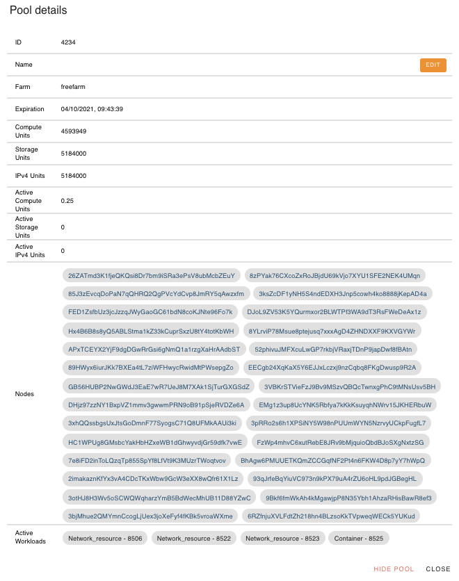

# How to Reserve IT Capacity

### Select 'Pools' from the 'Infrastructure Solutions'

### Choose 'Create' to Create a New Capacity Pool

Select __'Create'__ if you have not created any capacity pool before, or if you would like to create a new separate pool from your already existing one. Select __'Extend'__ if you would like to reserve more capacity on one of the pools you have created.

### Specify the Amount of CU and SU You Want to Add to the New Capacity Pool

__CU__ stands for __Compute Unit__; it is the amount of data processing power specified as the number of virtual CPU cores (logical CPUs) and RAM (Random Access Memory). __SU__ stands for __Storage Unit__; it is the size of data storage capacity. CU and SU are components of __TF's Cloud units__; the components that account for farmed and used capacity. Cloud units are the compute, storage and network equivalent to kWh - kilowatt-hour - the unit of energy. 

More precisely, 1 CU corresponds to 1 core and 4 GB of RAM. 
1 SU corresponds to a storage capacity of 800 GB of HDD plus 40 GB of SSD (definition until end of 2020). 

Feel free to go to [__Grid Concept__](definitions_concepts) section of TF Grid Wiki to learn more about Cloud Units.

Specify also the __Pools Time-to-live__. 
Remark: this is a theoretical value. It assumes that the fully reserved capacity is depleted after the indicated number of units and under the condition that the capacity is fully used. In practice, only the capacity that is consumed by deployed IT workloads reduces the counter. 

### Choose Your Farm Preference to reserve IT Capacity From

Please keep in mind that capacity on testnet is limited. We only listed one 'demo farm' as a farm to reserve testnet IT Capacity from so please make sure to allow over provisioning from the settings tab in dashboard and for more info visit [over provisioning page](https://manual2.threefold.io/#/3bot_settings?id=developers-options). On a mainnet environment there are many farms available to choose from, you would eventually be able to choose to reserve IT capacity from one of your preferred farms.

### Prepare to Pay for the Reserved IT Capacity

Pay for your capacity, either by selecting a preconfigured wallet in the Admin panel or by using a wallet that is configured in your ThreeFold Connect app, by scanning the QR Code (not for testnet). A third option is to do it manually by copying the __Wallet Address__, __Reservation ID (Memo Text)__, and __Total Amount__ you would have to pay for your capacity. 
Open your Stellar wallet and send the total amount of tokens to the IT Capacity reservation wallet address. This is an example of a payment page from a [Interstellar Wallet](https://interstellar.exchange/) on testnet. You could also use a [Solar Wallet](https://solarwallet.io/#download), or any other existing Stellar wallet to pay for your capacity.

Once payment is signed for, the payment process starts. 

### Pay for Your Capacity via Stellar Wallet

Go back to the admin panel page, click __next__ on the previous payment page to check if you have successfuly made the payment via your wallet. The screen would show the above instruction once the payment is successfully made. Please resend the payment via wallet if you did not do it successfully, or [__contact our helpdesk__](https://threefoldfaq.crisp.help/en/) for payment assistance.

### Find back your reserved capacity in the capacity pool overview

Once payment is confirmed, the reserved capacity is added to the list, indicating the number of CUs and SUs as the unit multiplied by the duration (expressed in seconds).

 Each capacity pool is named after few digits of auto generated numbers and is always listed on the first page of your __Pools__ submenu. Click on __'Pool Number'__ to see the details of each __capacity pool's workload__. It will take a few minutes after your successful reservation transaction for the details of the active cloud units and active storage units to be properly updated. Please [__contact our helpdesk__](https://threefoldfaq.crisp.help/en/) for any help and assistance in managing your capacity pools.

 