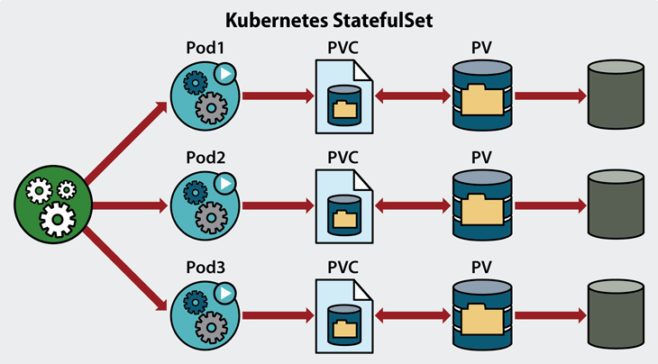

# Advanced kubernetes features

## Storage

### Local Path k3s storage class

When deploying an application that needs to retain data, you’ll need to create persistent storage. Persistent storage allows you to store application data external from the pod running your application. This storage practice allows you to maintain application data, even if the application’s pod fails.

A persistent volume (PV) is a piece of storage in the Kubernetes cluster, while a persistent volume claim (PVC) is a request for storage.



PV has three access modes : 

- **RWO** : Read Write Once. It could only be read/write on one node at any given time
- **RWX** : Read Write Many. It could only be read/write on multiple node at the same time
- **ROX** : Read Only Many

K3s comes with Rancher’s Local Path Provisioner and this enables the ability to create persistent volume claims out of the box using local storage on the respective node.
StorageClass "local-path": Only support ReadWriteOnce access mode

let's create a hostPath backed persistent volume claim and a pod to utilize it:

```
$ cd ressources/storage/simple-localpath/
$ kubectl create -f pvc.yaml
$ kubectl create -f pod.yaml
$ kubectl get pods -n default
NAME       READY STATUS RESTARTS AGE
volume-test     1/1  Running 0   2m

```

## Load balancing and external IP

#### Klipper

K3s comes with [Klipper](https://github.com/rancher/klipper-lb). It assigns the IP of the node to the loadBalancer service. This works by using a host port for each service load balancer and setting up iptables to forward the request to the cluster IP.

This means that klipper could't provision other IP for that we need metalLB

#### Metal LB

The idea is to have a fix IP to connect to that could handle load balancing between the pods. We use metallb to provision IP on demand for LoadBalancer services.
We could apply the first two files in the metallb folder

```
$ cd ressources/metallb
$ kubectl create -f 1-metallb.yaml
$ kubectl create -f 2-config_and_registration_service.yaml
```

this will install metallb on our cluster and configure it via a configmap
and lastly it will create a service of type loadbalancer with a fix IP `173.30.1.168`
Take a look at the configmap if you want to modify the IP range available to metalLB.

## Public IP

### Accessing the cluster from a public domain

we need to initiate a connection from the cluster to an external machine with a public IP. We direct the tunnel to the traefik (or any other ingress controller) service IP

```
$ kubectl get svc -n kube-system
NAME    TYPE   CLUSTER-IP  EXTERNAL-IP PORT(S)          AGE
kube-dns   ClusterIP  10.43.0.10  <none>  53/UDP,53/TCP,9153/TCP      6d5h
metrics-server ClusterIP  10.43.36.33  <none>  443/TCP          6d5h
traefik   LoadBalancer 10.43.178.254 172.31.1.50 80:32015/TCP,443:32432/TCP,8080:30137/TCP 6d5h
```

We tried with [inlets](https://github.com/inlets/inlets).

Follow the guide and you will end up executing this kind of command on your master node.

```
inlets client --remote "mydomain.be:8080" --upstream "http://172.30.1.50:80" --token "${AUTHTOKEN}"
```

If you have deployed the drupal-mysql example which contains an ingress ressources you could modify the ingress to the domain name here it is mydomain.be so that now when you hit http://mydomain.be you are redirected to the drupal website

## CNI

Container networking is the mechanism through which containers could optionally connect to other containers, the host, and outside networks like the internet.
The idea behind the CNI initiative is to create a framework for dynamically configuring the appropriate network configuration and resources when containers are provisioned or destroyed.

### Benchmark

**Resources consumption**

**Performance**

**Network Policies and Encryption**

### Flannel by default

It is one of the most mature examples of networking fabric for container orchestration systems, intended to allow for better inter-container and inter-host networking.

From an administrative perspective, it offers a simple networking model that sets up an environment that’s suitable for most use cases when you only need the basics.

By default, K3s will run with flannel as the CNI.
The default backend for flannel is VXLAN. We could enable encryption by passing the IPSec (Internet Protocol Security) or WireGuard options .

### Calico

Project Calico, or just Calico, is another popular networking option in the Kubernetes ecosystem. While Flannel is positioned as the simple choice, Calico is best known for its performance, flexibility, and power. Calico takes a more holistic view of networking, concerning itself not only with providing network connectivity between hosts and pods, but also with network security and administration. The Calico CNI plugin wraps Calico functionality within the CNI framework.

calico kernel requirement

- nf_conntrack_netlink subsystem
- ip_tables (for IPv4)
- ip6_tables (for IPv6)
- ip_set
- xt_set
- ipt_set
- ipt_rpfilter
- ipt_REJECT
- ipip (if using Calico networking)

Unlike Flannel, Calico does not use an overlay network. Instead, Calico configures a layer 3 network that uses the BGP routing protocol to route packets between hosts. This means that packets do not need to be wrapped in an extra layer of encapsulation when moving between hosts. The BGP routing mechanism could direct packets natively without an extra step of wrapping traffic in an additional layer of traffic.

In addition to networking connectivity, Calico is well-known for its advanced network features. Network policy is one of its most sought after capabilities. In addition, Calico could also integrate with Istio, a service mesh, to interpret and enforce policy for workloads within the cluster both at the service mesh layer and the network infrastructure layer. This means that you could configure powerful rules describing how pods should be able to send and accept traffic, improving security and control over your networking environment.

Run K3s with --flannel-backend=none
./k3s server --flannel-backend=none &

## HA :warning: (WIP) :construction_worker:


