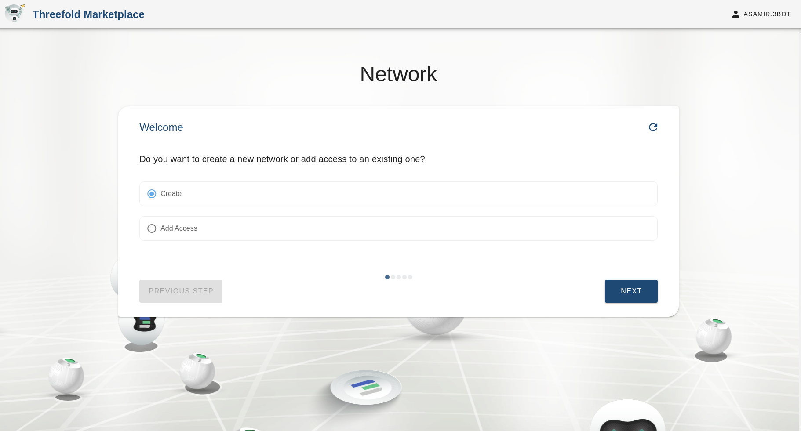
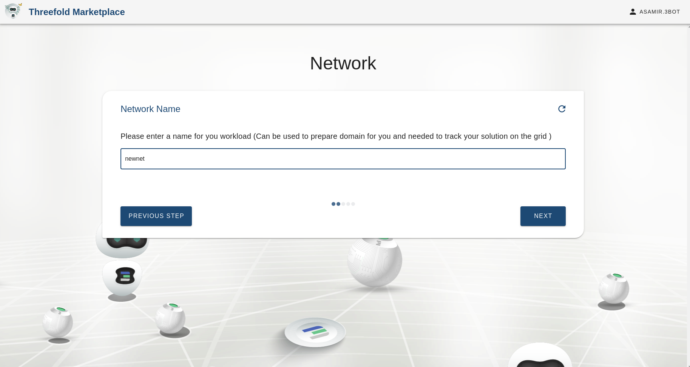
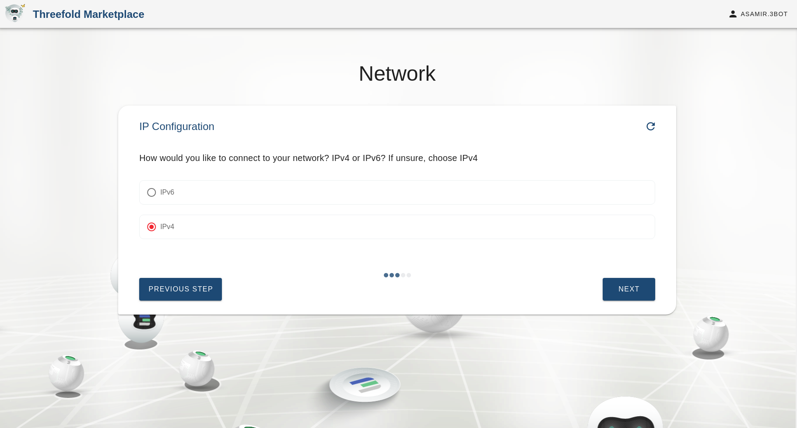
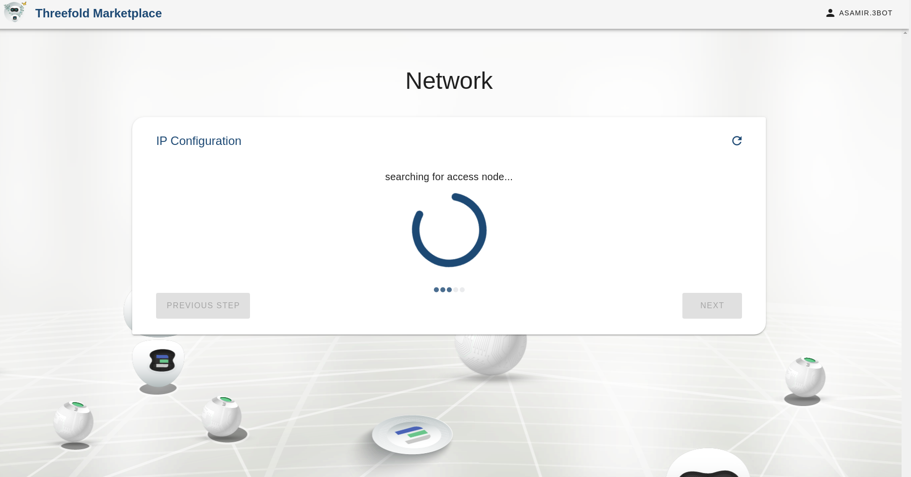
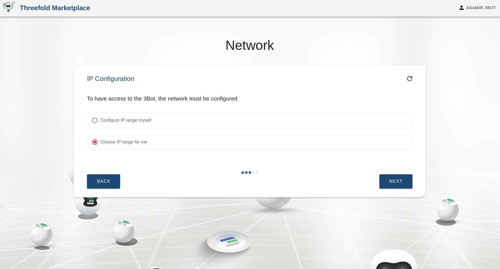
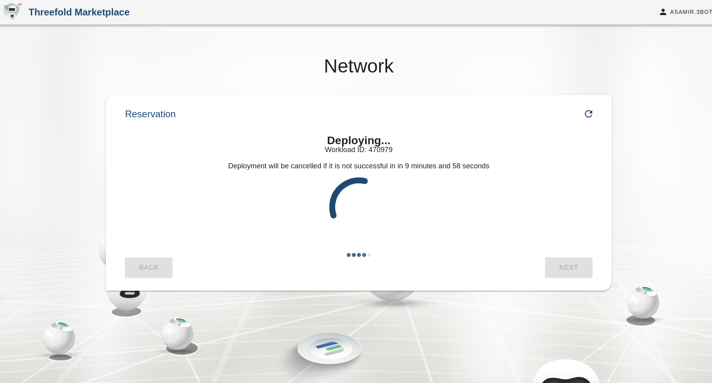
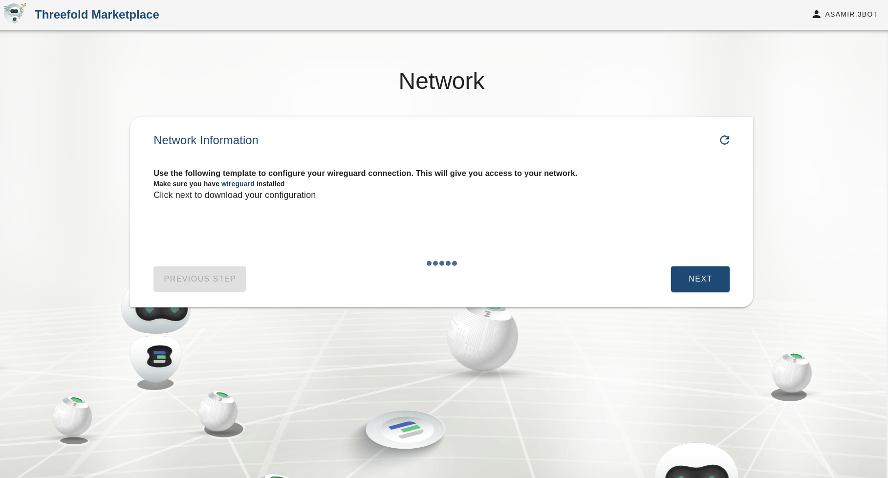
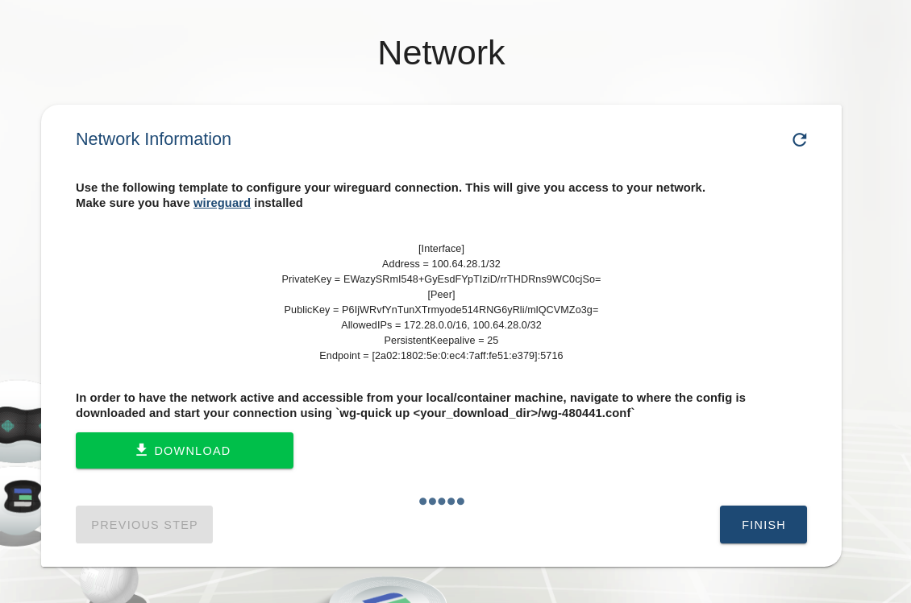
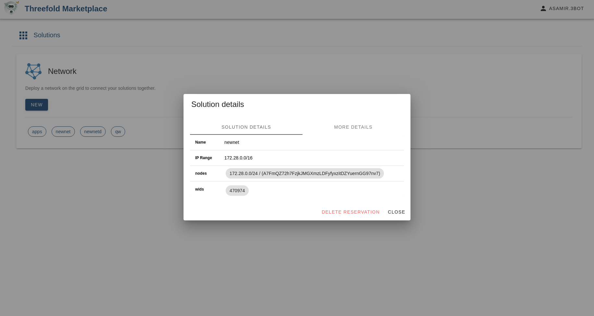

# Network solution

This chatflow is used to deploy a network on the grid and to connect your solutions together.

To access it, go to your hosted 3Bot Admin Panel, and select __Network__.

## Inputs

The solution takes some configurations from the user, we will list them and explain their meaning

- `Network name` : a name for the network to deploy on and also to reference in the reservation manager.
- `IP version` : (IPv4 or IPv6) Version of the entrypoint node.
- `IP range` : Configure network manually by choosing an IP range to use or the deployer could choose for you and generate an IP range automatically

## Chatflow steps

### Choose whether you want to create a new network or add access to an existing one

### Choose the network name

### Choosing how to reach the entrypoint node
To reach your solution on the grid you could use IPv6, problem is some countries don't have that infrastructure so we provide them access with an IPv4 entrypoint.

### Searching for access node

### The network IP Range
You can select an IP range for your solution to connect on.

### Deploying your network

### Wireguard install
Make sure you have Wireguard installed.

### Wireguard configurations
While the grid is built around IPv6 you can still connect with IPv4 with Wireguard.

### Configuring your machine
Now you need to configure your machine to access the network by applying the wireguard configuration.

## Access solution info from the network page
