# Generic Flist solution

This Solution helps to spawn a container using specific Flist provided by the user in the chatflow.

### Inputs

The solution takes some configurations from the user, we will list them and explain their meaning.

- `container name`: A name of your conatiner to help you to get it again with reservation id.
- `Flist link`: The link of your Flist to be deployed. For example: https://hub.grid.tf/usr/example.Flist.
- `environment variables`: Set environment variables on your deployed container, enter comma-separated variable=value For example: var1=value1, var2=value2. Leave empty if not needed.
- `Interactive`: Choose whether you prefer to access your container through the web browser (coreX) or not.
- `IP Address`: Choose the ip address for your Flist.

After the deployment of the Flist is complete, a url will be returned that could be used to access the container through web browser (corex) or by ssh if your Flist support this.

## Deploying a Container with a custom Flist

#### Choosing the solution name
Choosing the name of the solution to be deployed. This allows the user to view the solution's reservation info in the dashboard deployed solutions
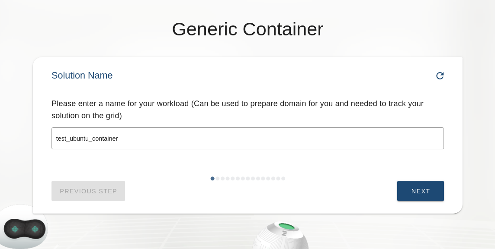

#### Choosing the number of CPU cores and memory size
Specify the number of CPU cores and the size of the memory to be used by the container.
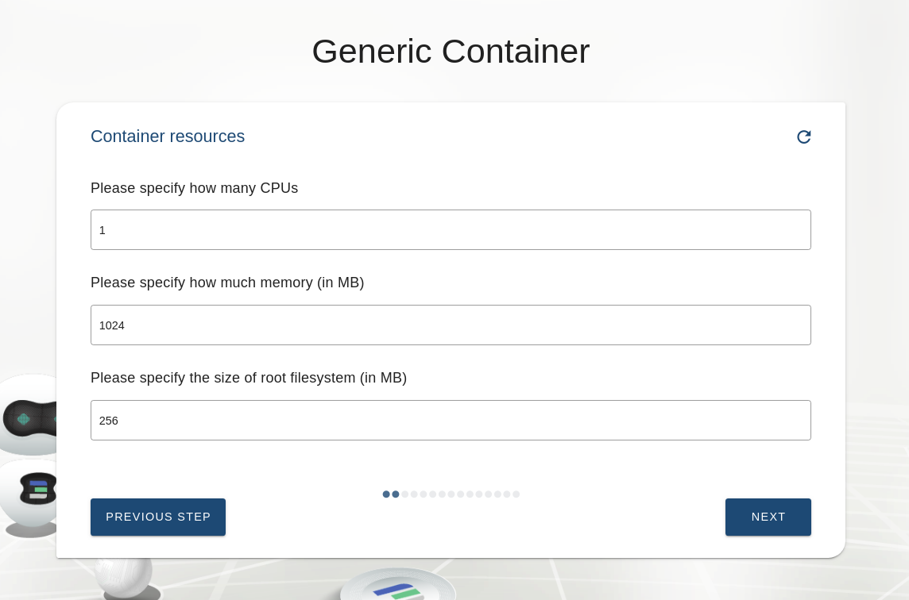

#### Choose whether you want to attach a volume to the container or not
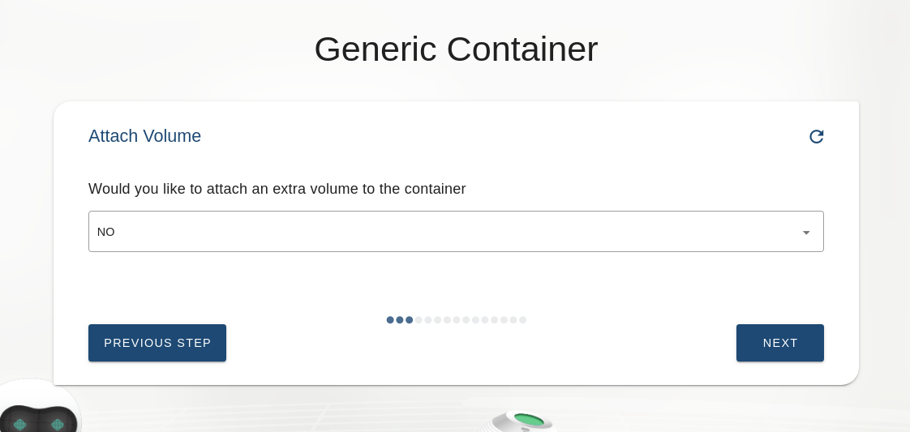
- If `Yes`, You need to choose the volume size and its mount point in the next step.
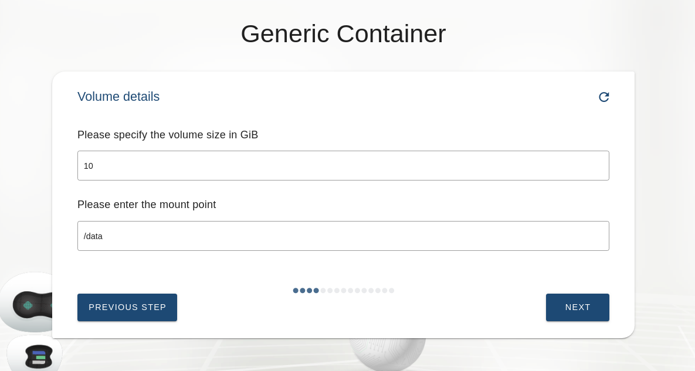

#### Select pool for your solution to be deployed on
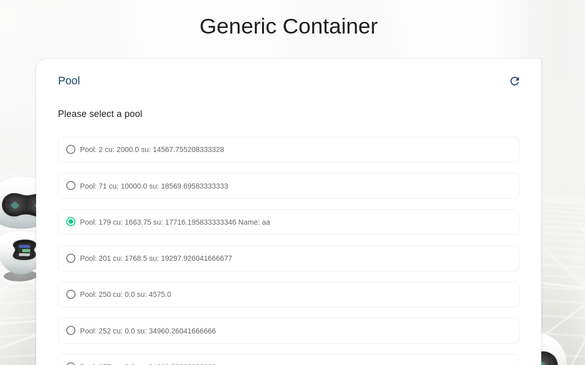

#### Select network for your solution to be deployed on
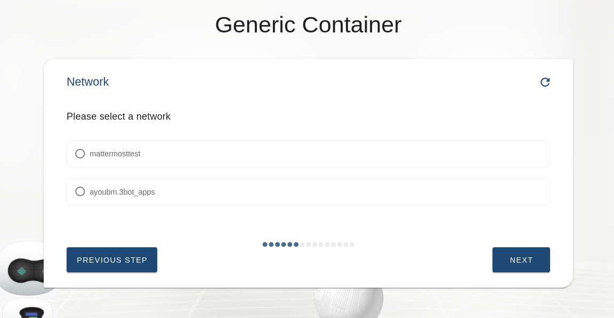

#### Flist link
The Flist link added is used to create the container from it. The link is from the Flist uploaded on the hub
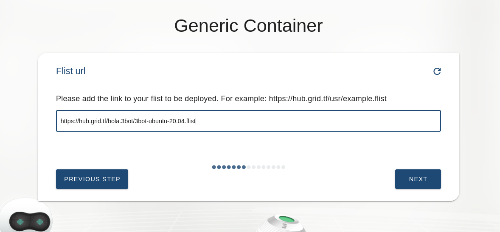

#### Using corex
The corex option allows the user to access the container through corex. If disable the user could access the container using ssh
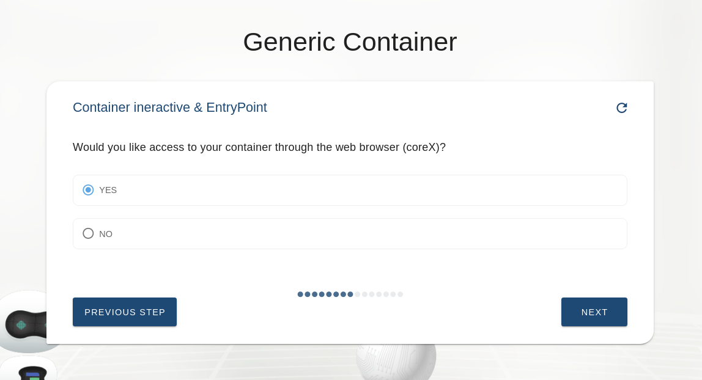

#### Select node or leave it empty
Here we could provide a node id corresponding to a node on the grid to deploy the container on. This node has to be part of your Capacity pool.
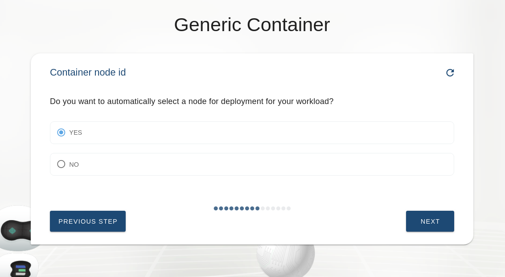

#### Choose whether you want to push the container logs onto an external redis channel or not
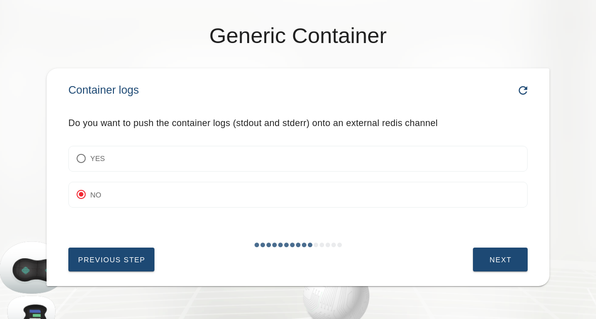

#### Choosing the private IP address of the container
Choosing the private IP address that will be used to access or communicate with the deployed solution.
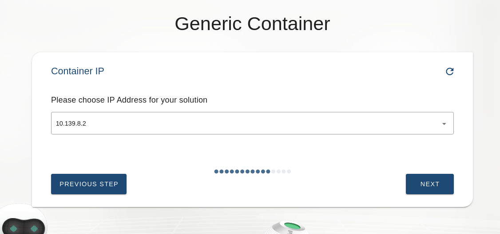

#### Choosing environment variables
If the container needs any env variables on startup, they are passed through this option where they are in the format `variable=value` seperated by commas.
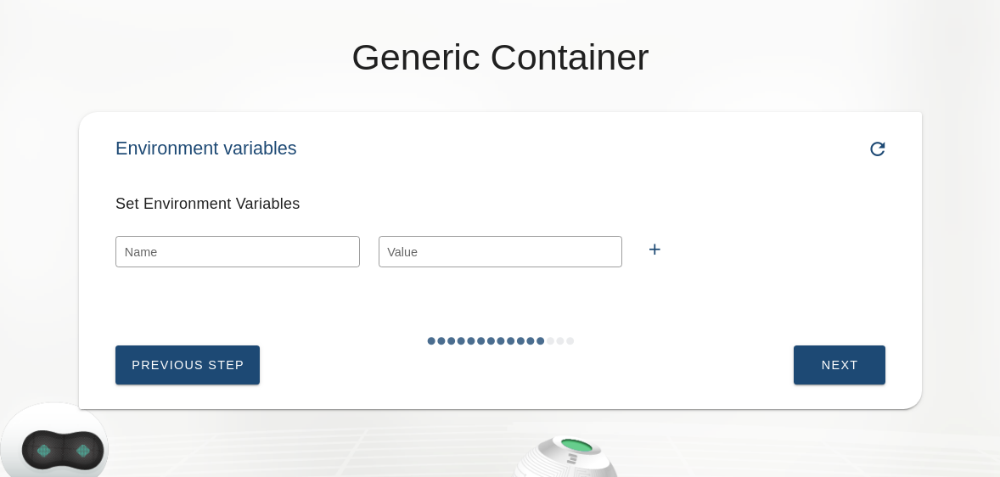

### Choose whether you want to assign a global Ipv6 address for your container or not
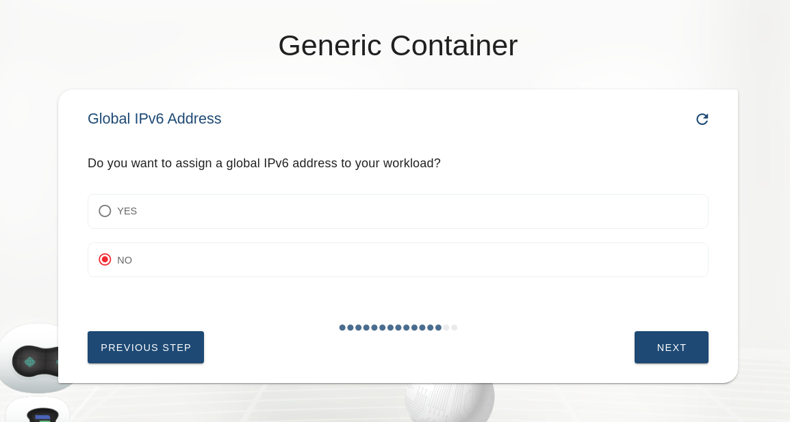

### Deploying your solution
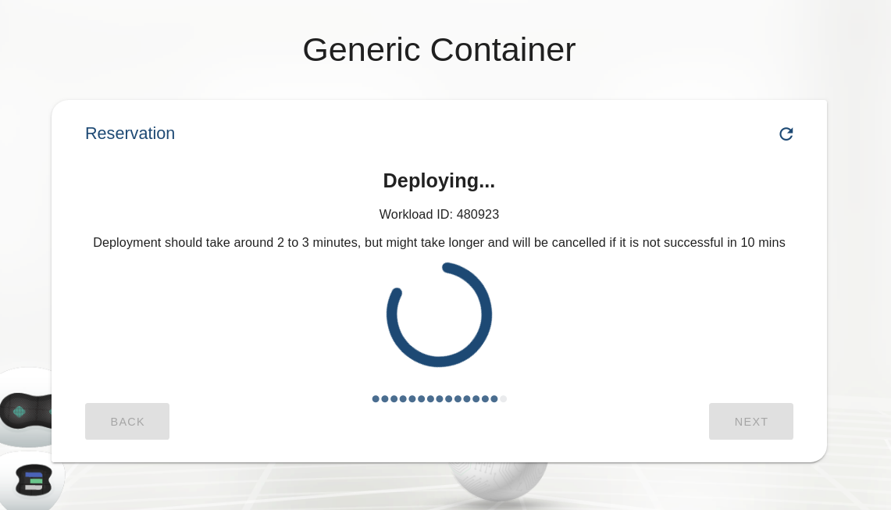

#### Successfully deployed
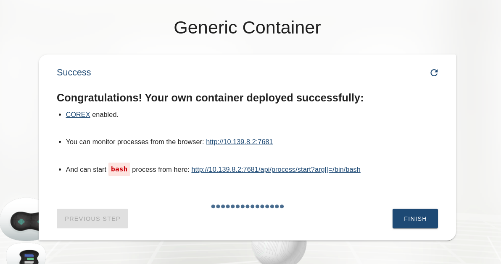

#### Access solution info from the Generic Flist solution page
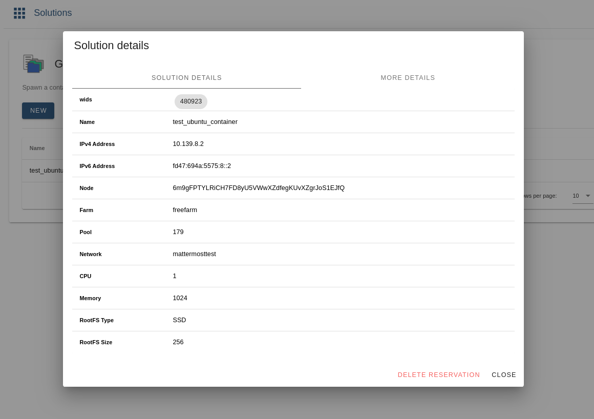