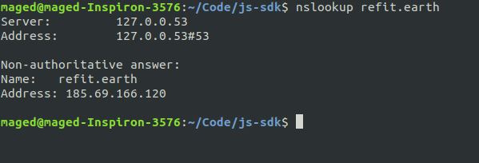
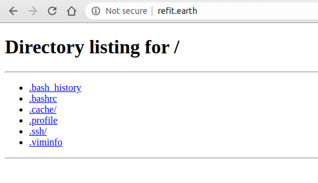
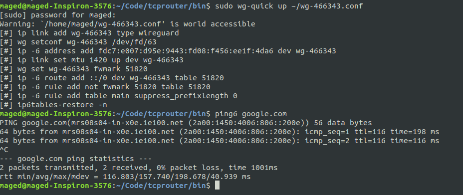

## Using the Web Gateway

### Overview

The aim is to delegate your domain to the gateway, access your running web applications using custom domains, subdomains of your delegated domain or any managed domains where we need to follow a few steps:

- choose a gateway
- delegate your domain to that gateway.
- create subdomains using that domain.
- create a tcp reverse proxy on the gateway.
- use `trc` Flist to expose your running containers.
- managed domain example
- custom domain example

Also show how to use the gateway4to6 workloads for users with IPv4 only networks to get IPv6 connectivity through the gateway

#### What is solution expose?

When deploying a container on the grid you can access it over public IPv6 (if specified) which you can bind an `AAAA` record to it or over your wireguard connection to the network. But if you have a web app running inside your container and you need to access it over a FQDN bound to an IPv4 address you can expose that container using a `TF Gateway`.

#### Expose options

When you decide to expose your workload using a `TF Gateway`, there are different approaches to achieve that.

1- Using a `Delegated Domain`: in this case you first delegate your domain to a gateway using a `domain delegation workload` and add an `NS` record in your dns manager of that domain pointing to the gateway dns server. then you can create `subdomain` of your delegated domain and use them in `tcp reverse proxy` worklooads.

2- Using a `Managed Domain`: most gateways offer some domain names that you can create a `subdomain` of them without having to delegate your domain to the gateway. and later you can use these subdomains in your `tcp reverse proxy` workloads.

3- Using a `Custom Domain`: in this case you create a `tcp reverse proxy` on a gateway and bind it to a domain name. But you'll have to create an `A` record of this domain name pointing to the gateway IP address yourself.

#### Note: that the only option you can use if want to access a container using a FQDN like `mydomain.com` without any additions (ie: `mysite.mydomain.com`) is using a `Custom Domain` approach where you create an `A` record of `mydomain.com` pointing to the IP address of the gateway.

#### Choose a gateway

```python
# fetch all gateways
gateway_ids = {g.node_id: g for g in j.sals.zos.gateways_finder.gateways_search() if j.sals.zos.nodes_finder.filter_is_up(g)}

# fetch your pool
pool = j.sals.zos.pools.get(1)

# select a gateway available in your pool
gateway = None
for gid, g in gateway_ids.items():
 if gid in pool.node_ids:
  if not g.dns_nameserver:
   continue
  gateway = g
  break
if not gateway:
 raise j.exceptions.Input(f"pool {pool.pool_id} doesn't include any gateway")
```

You can view the location of the gateway by printing the `location` property of the gateway object. For example, to view the location of _6RZfnjuXVLFdtZh218hn4BLzsoKkTVpweqWECk5YUKud_ after executing the previous script, you'd write:

```python
print(gateway_ids['6RZfnjuXVLFdtZh218hn4BLzsoKkTVpweqWECk5YUKud'].location)
```

#### Delegate your domain to the gateway

```python
# delegate your domain
DOMAIN = "waleed.grid.tf"
domain_delegate = j.sals.zos.gateway.delegate_domain(gateway.node_id, DOMAIN, pool.pool_id)
wid = j.sals.zos.workloads.deploy(domain_delegate)
```

got to your dns manager and create an `ns` record pointing to the gateway name `gateway.dns_nameserver[0]` then you could create subdomains of that domain and the gateway will create A records for it.

#### Create subdomains

```python
# we will use the gateway IP address for the subdomain to use it to expose our workloads
SUBDOMAIN = "srv1.waleed.grid.tf"
gateway_ips = []
for ns in gateway.dns_nameserver:
 gateway_ips.append(j.sals.nettools.get_host_by_name(ns))
subdomain = j.sals.zos.gateway.sub_domain(gateway.node_id, SUBDOMAIN, gateway_ips, pool.pool_id)
wid = j.sals.zos.workloads.deploy(subdomain)
```

now you could actually see that your subdomain is resorvable.


#### Create tcp reverse proxy

```python
# you need to have a secret for your reverse proxy which will be used by trc container to connect to the gateway. the format is {tid}:{arbitary_value}
import uuid
SECRET = f"{j.core.identity.me.tid}:{uuid.uuid4().hex}"

# create your tcp reverse proxy
reverse_proxy = j.sals.zos.gateway.tcp_proxy_reverse(gateway.node_id, SUBDOMAIN, SECRET, pool.pool_id)
wid = j.sals.zos.workloads.deploy(reverse_proxy)
```

#### create trc container to expose an already running workload

```python
# trc container initializes a tunnel with the gateway and forwards the traffic recieved on that tunnel to a specified address (the workload you want to expose)
# solution address config

SOLUTION_IP_ADDRESS = "10.212.2.2" # IP address of the workload you want to expose
SOLUTION_PORT = 8000
# I'm using an ubuntu container running python3 -m http.server to demonstrate so the below port will not be used
SOLUTION_TLS_PORT = 8443 
GATEWAY_IP = gateway_ips[0]

entrypoint = f"/bin/trc -local {SOLUTION_IP_ADDRESS}:{SOLUTION_PORT} -local-tls {SOLUTION_IP_ADDRESS}:{SOLUTION_TLS_PORT}" f" -remote {GATEWAY_IP}:{gateway.tcp_router_port}"

# trc container deployment
NODE_ID = "72CP8QPhMSpF7MbSvNR1TYZFbTnbRiuyvq5xwcoRNAib"
NETWORK = "demo_net"
FLIST_URL = "https://hub.grid.tf/tf-official-apps/tcprouter:latest.flist"
CONTAINER_IP_ADDRESS = "10.212.2.10"
secret_env = {"TRC_SECRET": j.sals.zos.container.encrypt_secret(NODE_ID, SECRET)}
container = j.sals.zos.container.create(
 node_id=NODE_ID,
 network_name=NETWORK,
 ip_address=CONTAINER_IP_ADDRESS,
 flist=FLIST_URL,
 capacity_pool_id=pool.pool_id,
 entrypoint=entrypoint,
 secret_env=secret_env,
)
wid = j.sals.zos.workloads.deploy(container)
```

now you could access your server using the gateway


#### Managed domains example

- gateways could have managed domains that you could use to create subdomains directly without the need of delegating domains or having a domain in the first place.

```python
gateway.managed_domains # list of the managed domains
domain = gateway.managed_domains[0] # the gateway I'm using is "tfgw-testnet-01.gateway.tf"

# create a subdomain of a managed domain
subdomain = j.sals.zos.gateway.sub_domain(gateway.node_id, f"srv3.{domain}", gateway_ips, pool.pool_id)
wid = j.sals.zos.workloads.deploy(subdomain)
```

now you can use that subdomain in your tcp reverse proxy as above

#### Custom domain example

This is really simple. you first create a `tcp reverse proxy` workload with your domain as below

```python
# you need to have a secret for your reverse proxy which will be used by trc container to connect to the gateway. the format is {tid}:{arbitary_value}
import uuid
SECRET = f"{j.core.identity.me.tid}:{uuid.uuid4().hex}"
DOMAIN = "refit.earth"

# create your tcp reverse proxy
reverse_proxy = j.sals.zos.gateway.tcp_proxy_reverse(gateway.node_id, DOMAIN, SECRET, pool.pool_id)
wid = j.sals.zos.workloads.deploy(reverse_proxy)
```

Then create an `A` record pointing to the gateway IP address.
```python
# to get the gateway IP Addresses
gateway_ips = []
for ns in gateway.dns_nameserver:
 gateway_ips.append(j.sals.nettools.get_host_by_name(ns))
```

in my case



now you can run your `tcprouter` container to expose your workload same as above.



## Gateway4to6

This workload gives you a connection to IPv6 networks using a wireguard tunnel.

```python
# first you need a keypair to be used for your wireguard cofiguration.
# you could use existing ones or generate a pair like this
private_key, public_key = j.tools.wireguard.generate_key_pair()

# create gateway4to6 workload
gateway4to6 = j.sals.zos.gateway.gateway_4to6(gateway.node_id, public_key.decode(), pool.pool_id)
wid = j.sals.zos.workloads.deploy(gateway4to6)

# get result to build your wireguard config
result = j.sals.zos.workloads.get(wid).info.result


cfg = j.data.serializers.json.loads(result.data_json)
wgconfigtemplate = """
[Interface]
Address = {{cfg.ips[0]}}
PrivateKey = {{privatekey}}

[Peer]
PublicKey = {{peer.public_key}}
AllowedIPs = {{",".join(peer.allowed_ips)}}

Endpoint = {{peer.endpoint}}


"""
config = j.tools.jinja2.render_template(
 template_text=wgconfigtemplate, cfg=cfg, privatekey=private_key.decode()
)

# save your config
filename = "wg-{}.conf".format(wid)
j.sals.fs.touch(f"/home/maged/{filename}")
j.sals.fs.write_file(f"/home/maged/{filename}", config)
```

now you could start your wiregaurd config and access IPv6 addresses

